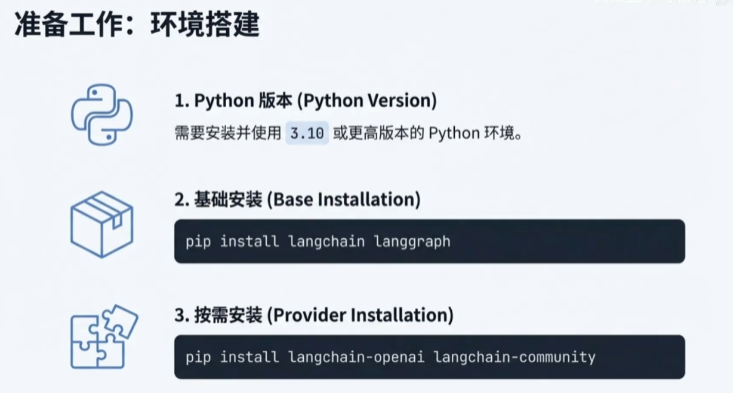

# Langchain V1.0实战-01入门和基础学习笔记
## 一、课程基本信息
- **课程来源**：B站视频合集【B站强推】清华大佬终于把Agent教程做成动画片了，教学通俗易懂，2026最新版，学完即可就业！拿走不谢，别再走弯路了，学不会我退出IT界！Agent智能体
- **视频定位**：该合集第8集，合集共61集，聚焦Langchain V1.0入门知识与实战基础

## 二、Langchain V1.0核心认知
### （一）框架地位
2025年底，Langchain已成为构建大语言模型（LLM）应用的**事实标准框架**，无明显竞争对手，是AI应用开发首选工具。

### （二）1.0+版本核心架构变化（对比1.0前版本）
| 对比维度  | 1.0前版本                                                                      | 1.0+版本                                                                      |
| --------- | ------------------------------------------------------------------------------ | ----------------------------------------------------------------------------- |
| 核心逻辑  | 链式编程（LCEL）                                                               | LangGraph图的Agent编排                                                        |
| 底层架构  | 基于类的继承，扩展依赖钩子机制                                                 | 以LangGraph为底层核心                                                         |
| 新增特性  | 无                                                                             | Middleware中间件（支持Agent执行前、中、后集成）                               |
| Agent构建 | 流程复杂，需深入理解多环节                                                     | 统一通过`create agent`方式构建                                                |
| 模型声明  | 各服务商类名不统一（如OpenAI对应`chat OpenAI`，Anthropic对应`chat anthropic`） | 统一用`INIT chat moder`方式，只需指定`model provider`（如open ai、ANTHROPIC） |

### （三）核心关联包
1. **基础包**：`langchain`（核心包，安装后自动附带`langgraph`）
2. **社区扩展包**：`langchain community`（提供社区贡献的扩展知识与功能）
3. **兼容包**：支持1.0前版本老架构，保障旧项目迁移
4. **模型服务包**：按服务商细分，如`langchain open AI`、`langchain anthropic`，适配不同LLM服务

## 三、环境准备与安装
### （一）前置要求

- **Python版本**：最低3.10，推荐3.43版本（适配最新Langchain功能）

### （二）安装步骤与版本验证
1. **安装命令**：在Google Colab平台执行，安装`langchain`及所需模型服务商包（如OpenAI包），加`-U`参数确保获取最新版本
2. **版本验证结果**：安装成功后，`langchain`版本为1.1.0，`langgraph`版本为1.0.3，模型服务商包（如OpenAI）版本与`langchain`保持一致

## 四、核心功能实战演示
### （一）模型调用（含国内模型适配）
1. **API Key配置**：以硅基流动为例，在Colab平台通过`user data.get`加载环境变量中的API Key（硅基流动千问三8B模型免费，可自行注册使用）
2. **国内模型适配关键**：需额外配置`base URL`（模型调用基础地址），再结合API Key完成模型声明
3. **调用示例**：用`in chair mode`声明模型后，调用`model.invoke`方法，以“天空为什么是蓝色的”为问题，成功获取模型推理结果

### （二）多轮对话实现
1. **核心逻辑**：声明`message`对象存储对话历史，通过死循环实现交互——用户输入问题→加入`message`队列→模型调用后将结果也加入队列→保持完整上下文
2. **效果验证**：先让模型生成冒泡算法，后续追问“这个算法”相关问题，模型可基于历史对话理解“这个算法”指冒泡算法，准确回应

### （三）流式输出
1. **关键区别**：与普通调用（`model.invoke`）不同，流式输出使用`model.stream`方法
2. **实现方式**：接收模型返回的“块（chunk）”，实时读取`chunk.content`并输出，避免用户长时间等待
3. **优势**：提升用户体验，是当前AI应用常见交互方式

### （四）简单Agent调用
1. **Agent核心特性**：可调用`tools`工具，仅当问题与工具功能匹配时才触发工具调用
2. **工具声明**：需用`ADD to`装饰器标记工具方法（示例：`get value`天气查询工具，功能为返回“某城市天气是否为晴天”）
3. **调用逻辑**：与模型调用一致，使用`agent.invoke`方法；若问题与工具无关（如非天气类问题），则等同于普通模型调用
4. **示例效果**：提问“北京天气怎么样”，Agent成功调用天气工具，返回“北京天气是晴天”

## 五、综合实战：智能翻译助手
### （一）核心配置
1. **模型参数**：除基础声明外，设置`temperature=0.3`（该参数0-1区间，值越小回答越保守固定，适合翻译任务准确性要求）
2. **输入参数**：设计方法接收3个关键参数——待翻译文本、目标语言、翻译风格（正式/口语）

### （二）提示词设计
1. **系统提示词**：定义角色为“专业翻译助手”，明确翻译目标（对应目标语言、风格）
2. **格式约束**：采用`one shot`方式（提供1个输出示例），引导模型按指定格式输出；若需更高准确性，可扩展为`few shots`（提供多个示例）

### （三）效果演示
1. 英文句子“lang chain is a framework for developing Applications Powered by large language models”→翻译为口语化中文
2. 中文文本→翻译为英文，均按指定格式和风格输出，符合翻译任务要求